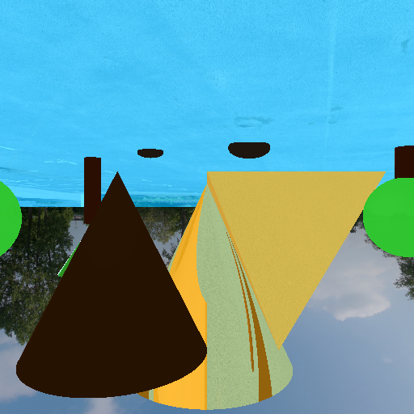

# computer-graphics

## Image render

- Código fuente capaz de renderizar planos, discos y cubos por medio de un Ray Intersect Algorithm.
- El programa principal debe mostrar un cuarto hecho con planos similar a la imagen (mínimo de cinco planos, material de su elección). Dentro del cuarto colocar dos cubos en cualquier posición y un disco en cualquier posición y orientación.
- Usen los materiales que quieran.

