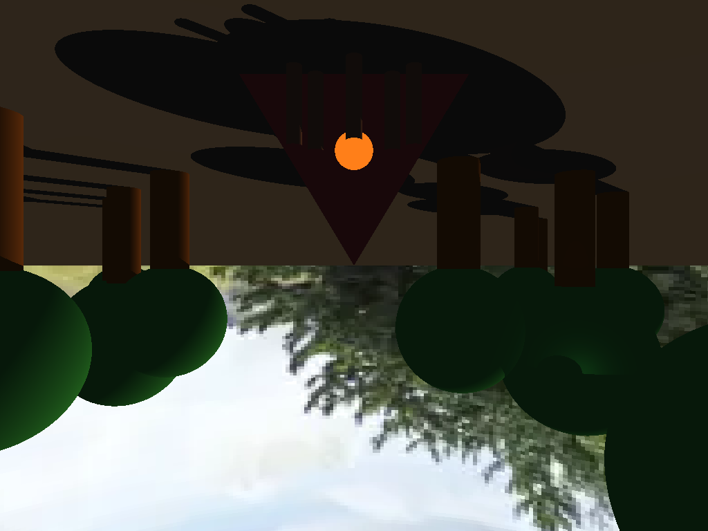
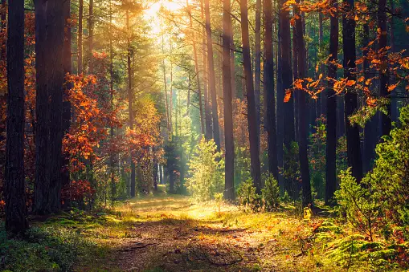

# computer-graphics

## Proyecto 2: Ray Tracing

El objetivo de éste proyecto es demostrar los conocimientos adquiridos durante la segunda parte del curso.

Los alumnos deben entregar un Ray Tracer simple que trate de recrear una escena/imagen escogida por el alumno por medio de figuras simples.

La nota máxima es de 100 puntos. Se entregarán los siguientes puntos por cada uno de los objetivos que se cumplan. Pueden escoger los objetivos que quieran. No hay puntos extra.

30 puntos máximos por complejidad de la escena.
Menos de 5 figuras: 10 puntos
Entre 5 y 10 figuras: 20 puntos
Más de 10 figuras: 30 puntos
20 puntos por materiales.
Máximo de 4 materiales que se calificarán. 5 puntos por cada uno.
Por lo menos un material debe usar textura.
5 puntos por implementar un Environment Map.
Si se implementó refracción y reflección, el EnvMap debe ser tomado en cuenta por ellos.
20 puntos máximos por figuras geométricas distintas a las vistas en clase. Máximo de 4 figuras.
5 puntos por cada figura nueva.
Pueden usar las figuras que ya crearon en el Laboratorio #3.
Este punto se refiere a crear, por medio de código, una nueva figura o una nueva implementación de un Ray Intersect Algorithm para nuevas figuras.
20 puntos por implementar el renderizaje de un modelo OBJ por medio de ray tracing.
0 - 20 puntos según la estética de la escena.
0 - 10 puntos por la iluminación de la escena (múltiples luces, directional lights, point lights, spotlights, etc)
No olvidar entregar la imagen de referencia y la imagen final junto con el proyecto. Sin cada una de estas, no se recibirá nota. Se les anima a compartir sus resultados en el canal ShowOff del Discord.

Para que una figura o modelo cuente dentro del puntaje, debe de ser proyectado en perspectiva con respecto a una cámara. Ustedes pueden definir la posición de la cámara o de la luz. Pueden usar texturas o modelos que encuentren en internet, no necesitan hacerlos ustedes mismos. Deben usar su propia librería de Matemáticas o perderían puntos.

### Escena

### Original

